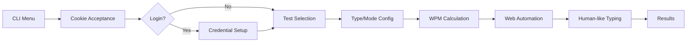

# ⌨️ MonkeyType Bot

[](https://python.org)
[](https://selenium.dev)
[](LICENSE)

An intelligent automation bot that simulates human typing on MonkeyType, with typing speed control and support for different test types.

[readmeai-cli-demo][cli-demo]

---

## 🚀 Key Features

- **🤖 Realistic Automation** - Simulates human typing with random timing variations
- **🎯 Multi-Mode Support** - Supports timed tests, word tests, and quote tests
- **🔐 Automatic Login** - Persistent access via credentials stored in `.env`
- **⚡ Custom WPM Control** - Set desired typing speed
- **🍪 Cookie Management** - Automatic acceptance of cookies and initial popups

---

## 🧠 Technical Highlights

- **Web Automation** with Selenium WebDriver and Firefox
- **Advanced Pattern Matching** for navigating dynamic DOM elements
- **Timing Algorithm** that calculates delays based on the formula `60 / (wpm * 4.3)`
- **Environment Variables** for secure credential management
- **Robust Exception Handling** for non-interactable UI elements

---

## 🗺️ Architecture & Workflow



---

## ✨ Code Highlights

### 🎮 Human-like Timing Algorithm
```python
def take_test(time_to_sleep):
    # ... code ...
    for char in current_word:
        key_input.send_keys(char)
        
        variation = time_to_sleep * 0.8
        sleep_time = random.uniform(time_to_sleep - variation, time_to_sleep + variation)
        
        time.sleep(sleep_time)  # Variable timing to appear human
```

### 🧠 Dynamic UI Navigation
```python
def select_test(type_index, mode_index):
    # Dynamic XPATH calculation based on selection
    mode_btn = driver.find_element(By.XPATH, 
        f'/html/body/div[11]/main/div/div[1]/div/div[{4 + type_index}]/button[{mode_index + 1 if type_index == 3 else mode_index}]')
```

---

## 🛠️ Project Structure

```
monkeytype-bot/
├── UI.py              # User interface and interactive menu
├── Wrapper.py         # Core automation logic and Selenium wrapper
├── .env              # Credentials (gitignored)
└── requirements.txt  # Project dependencies
```

---

## 🧪 How to Run Locally

### Prerequisites
```bash
# Install Firefox
sudo apt install firefox  # Ubuntu/Debian

# Install geckodriver
wget https://github.com/mozilla/geckodriver/releases/download/v0.32.0/geckodriver-v0.32.0-linux64.tar.gz
tar -xzf geckodriver-v0.32.0-linux64.tar.gz
sudo mv geckodriver /usr/local/bin/
```

### Installation & Execution
```bash
# 1. Install dependencies
pip install selenium python-dotenv

# 2. Run the bot
python UI.py

# 3. Follow the menu instructions:
#    - Choose test type (1=Time, 2=Words, 3=Quote)
#    - Select mode
#    - Set desired WPM
```

### Login Configuration (Optional)
```bash
# The bot will automatically create a .env file on first run
echo "EMAIL=your@email.com" > .env
echo "PASSWORD=your_password" >> .env
```

---

## ⚠️ Legal & Ethical Disclaimer

**Educational Use Only**
- This project is created **exclusively for educational purposes** and learning automation technologies
- **Do not use for cheating or obtaining false scores** on typing platforms
- Developers are not responsible for misuse of the software
- Respect the Terms of Service of MonkeyType and other platforms

**Fair Use**
- Use responsibly and in moderation
- Do not overload target platform servers
- Consider the impact on other platform users

---

[cli-demo]: https://github.com/user-attachments/assets/956bc990-310e-4edd-a5b8-dcb830f5a995

